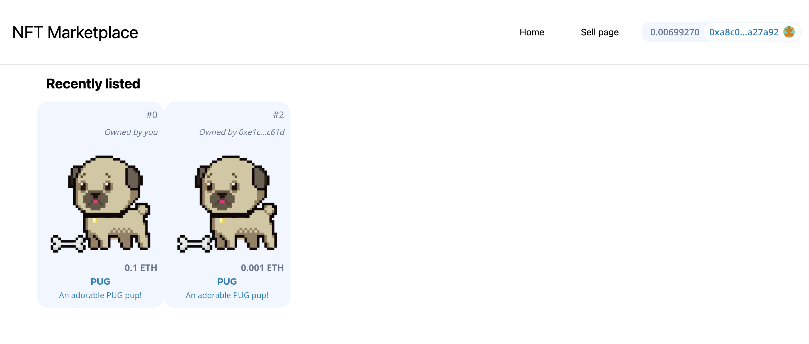

# NextJS NFT Marketplace with TheGraph

This project aim to create a transparent NFT marketplace for user to sell and buy NFTs. The data for listing items will be queried from TheGraph API endpoint.

### [Demo on Vercel](https://nft-marketplace-fawn-two.vercel.app)



## Acknowledgments

I would like to express my sincere gratitude to the creators and contributors of the [Full Blockchain & Solidity Course - JavaScript Edition](https://github.com/smartcontractkit/full-blockchain-solidity-course-js) by Free Code Camp. This project wouldn't have been possible without guidance and resources provided by this course.

-   **Course Instructor**: [Patrick Collin](https://www.youtube.com/channel/UCn-3f8tw_E1jZvhuHatROwA)

## Description

I divided this project into 2 repos: Smart contract development and Front-end development:  
[Front-end repo](https://github.com/TLBTrung-222/nextJS-nft-marketplace.git)  
[Smart contract repo](https://github.com/TLBTrung-222/hardhat-nft-marketplace.git)

Tech-stack:

-   Front-end:
    -   [`Next.js`](https://nextjs.org/) (popular React framework for the Web)
    -   [`react-moralis`](https://github.com/MoralisWeb3/react-moralis) (interaction between Front-end and blockchain)
    -   [`TheGraph`](https://thegraph.com/) (accessing the blockchain data)
    -   [`Apollo-client`](https://www.apollographql.com/) (query data from TheGraph API endpoints using graphql)
-   Smart contract:
    -   [`Hardhat`](https://hardhat.org/) (popular framework for developing smartcontract)
    -   [`hardhat-deploy`](https://github.com/wighawag/hardhat-deploy) (a hardhat plugin for replicable deployments and easy testing)

# Installation

### Requirements

You will need to have `node.js` and `yarn` installed.

## 1. Clone the repos

In it's own terminal / command line, clone both repos:

```bash
git clone https://github.com/TLBTrung-222/nextJS-nft-marketplace.git
git clone https://github.com/TLBTrung-222/hardhat-nft-marketplace.git
```

## 2. Deploy your contract to sepolia (optional)

You can choose to deploy a brand new contract or just use the contract I already deployed to blockchain. To deploy contract, remember to created `.env` file with your `PRIVATE_KEY` from your wallet (Metamask, ...).

After installing dependencies, deploy your contracts to sepolia

```bash
cd hardhat-nft-marketplace
yarn
yarn hardhat deploy --network sepolia
```

If you want to deploy contract to other network, make sure you have configured that network on `hardhat.config.js`

## 3. Deploy your subgraph

In order to listen for events emitted on blockchain to retrieve data, we will use TheGraph

1. Install Subgraph CLI

```bash
yarn global add @graphprotocol/graph-cli
```

2. Log into [the graph UI](https://thegraph.com/studio/subgraph) and create a new Subgraph.

Use `Ethereum Sepolia` as the network.

3. Install dependencies and Initialize Subgraph

```bash
cd ../nextJS-nft-marketplace
yarn
graph init --studio nft-marketplace
```

4. Authenticate CLI

```bash
graph auth  --studio YOUR_DEPLOY_KEY_HERE
```

5. Update your `subgraph.yaml`

-   Update the `address` with your NftMarketplace Address
-   Update the `startBlock` with the block right before your contract was deployed

6. Build graph locally

```bash
graph codegen && graph build
```

-   `graph codegen`: Generates code in the `generated` folder based on your `schema.graphql`
-   `graph build`: Generates the `build` folder that will be uploaded to the graph

7. Deploy subgraph

Replace `VERSION_NUMBER_HERE` with a version number like `v0.0.1`.

```bash
graph deploy --studio nft-marketplace -l VERSION_NUMBER_HERE
```

## 4. Start your UI locally

Make sure that:

-   You have created an `.env` file and have a `PRIVATE_KEY`
-   Your wallet have some ETH testnet to interact. If you don't, feel free to get some from [Sepolia ETH faucet](https://sepoliafaucet.com/)

```bash
yarn dev
```

Open [http://localhost:3000](http://localhost:3000) with your browser to see the result.
